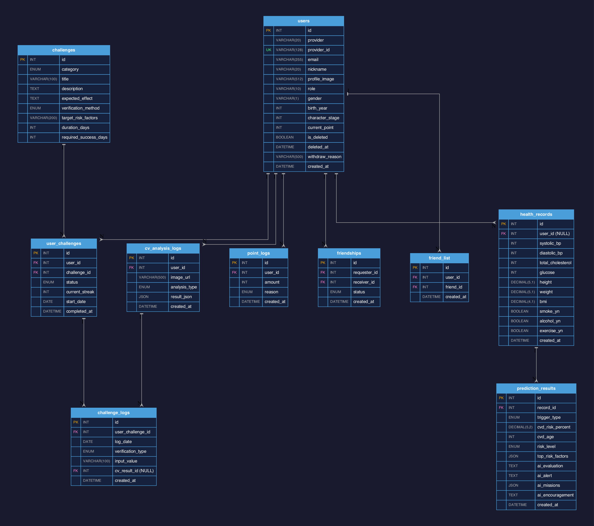

# ERD (Entity Relationship Diagram)

> SQL 원본: [erd.sql](erd.sql)

---

## 테이블 관계 요약

| 테이블 | 관계 | 설명 |
|---|---|---|
| users → health_records | 1:N | 사용자가 건강검진 수치 입력 |
| health_records → prediction_results | 1:N | 수치 입력 시 위험도 예측 |
| users → user_challenges | 1:N | 사용자가 챌린지 참여 |
| challenges → user_challenges | 1:N | 챌린지 종류별 참여 내역 |
| user_challenges → challenge_logs | 1:N | 챌린지 일별 인증 기록 |
| cv_analysis_logs → challenge_logs | 1:N | CV 인증 결과 연결 |
| users → cv_analysis_logs | 1:N | 이미지 분석 기록 |
| users → point_logs | 1:N | 포인트 적립/차감 내역 |
| users → friendships | 1:N | 친구 요청 |
| users → friend_list | 1:N | 확정된 친구 목록 |
